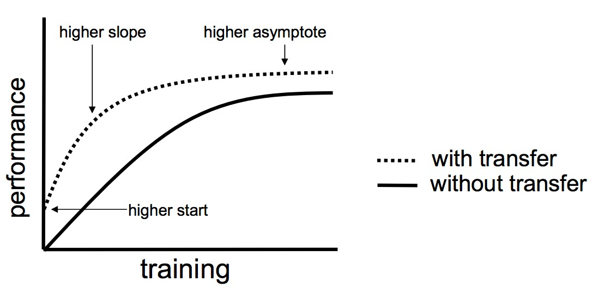

### Transfer learning

    Transfer Learning hay còn gọi là học chuyển giao là một phương pháp trong học máy (machine learning), trong đó kiến thức đã học từ một nhiệm vụ này được chuyển sang và ứng dụng cho một nhiệm vụ khác. Thay vì xây dựng một mô hình từ đầu, Transfer Learning tận dụng các mô hình đã được huấn luyện trên một tập dữ liệu lớn và chuyển giao các yếu tố học được sang bài toán mới giúp tiết kiệm thời gian và tài nguyên. Phương pháp này đã chứng minh tính hiệu quả cao trong các bài toán có tập dữ liệu hạn chế.

### Vai trò 

#### Chuyển giao tri thức

    Trong quá trình bùng nổ của deep learning, các tài nguyên về AI ngày càng dồi dào. Song song với quá trình phát triển đó,ngày càng có nhiều các pretrained-model có chất lượng tốt và độ chính xác cao. Hầu như mọi domain đều có thể tìm kiếm được các pretrained-model.

    Lý thuyết về transfer learning được Lorien Pratt thực nghiệm lần đầu năm 1993 và sau đó viết lại nó dưới dạng một lý thuyết toán học vào năm 1998 đã hiện thực hóa ý tưởng về chuyển giao tri thức giữa các mô hình như giữa con người với nhau.

    Một mô hình đã có khả năng tận dụng lại các tri thức đã huấn luyện trước đó và cải thiện lại trên tác vụ phân loại của nó.

#### Cải thiện độ chính xác và tiết kiệm chi phí huấn luyện

Từ đồ thị ta có thể thấy sử dụng transfer learning sẽ mang lại 3 lợi thế chính:
    Có điểm khởi đầu của accuracy tốt hơn (higher start).
    Accuracy có tốc độ tăng nhanh hơn (higher slope).
    Đường tiệm cận của độ chính xác tối ưu cao hơn (higher asymptote).

#### Hiệu quả với bộ dữ liệu nhỏ

    Trong trường hợp bộ dữ liệu có kích thước quá nhỏ và khó có thể tìm kiếm và mở rộng thêm thì các mô hình được huấn luyện từ chúng sẽ khó có thể dự báo tốt. Tận dụng lại tri thức từ các pretrained-model với cùng tác vụ phân loại sẽ giúp các mô hình được huấn luyện dự báo tốt hơn với dữ liệu mới vì mô hình được học trên cả 2 nguồn tri thức đó là dữ liệu huấn luyện và dữ liệu mà nó đã được học trước đó.

##### 🎓 1. Fine-tuning là gì?

###### ✅ Định nghĩa:

Fine-tuning là tận dụng toàn bộ mô hình đã học sẵn, nhưng tiếp tục huấn luyện lại toàn bộ trọng số 

của nó trên tập dữ liệu mới.

###### ⚙️ Cách hoạt động:

Bắt đầu từ một mô hình pretrained (ví dụ ResNet18 đã học trên ImageNet).

Thay fc layer cuối (do số class khác nhau).

Không đóng băng các layer: toàn bộ mô hình được “tinh chỉnh” lại với learning rate nhỏ.

###### 💡 Khi nào dùng fine-tuning?

Khi dữ liệu mới nhiều.

Khi domain mới khác nhiều so với domain cũ (ví dụ ImageNet là ảnh tự nhiên, bài toán mới là ảnh X-quang).

##### 🧊 2. Feature Extraction là gì?

###### ✅ Định nghĩa:

Feature extraction là giữ nguyên các layer trích đặc trưng của mô hình pretrained (đóng băng trọng 

số), chỉ huấn luyện lại phần phân loại (classifier) ở cuối.

###### ⚙️ Cách hoạt động:

Load mô hình pretrained.

Đóng băng tất cả các layer convolutional (chỉ dùng để extract features).

Thay fc layer cuối, huấn luyện nó từ đầu.

###### 💡 Khi nào dùng feature extraction?

Khi dữ liệu mới ít, hoặc bài toán tương tự bài học cũ.

Khi bạn cần huấn luyện nhanh, ít tài nguyên.

| Tiêu chí                    | Fine-tuning                              | Feature Extraction                    |
| --------------------------- | ---------------------------------------- | ------------------------------------- |
| ❓ Mục tiêu                  | Tinh chỉnh toàn bộ mô hình               | Dùng feature extractor đã học sẵn     |
| 🧊 Layer được freeze        | Không freeze gì                          | Freeze gần hết, chỉ train fc layer    |
| 🧠 Cần nhiều dữ liệu không? | Có, càng nhiều càng tốt                  | Không, phù hợp khi ít dữ liệu         |
| 🕐 Tốc độ train             | Chậm hơn                                 | Nhanh hơn                             |
| 🛠 Tính tùy biến            | Linh hoạt, thích nghi domain mới tốt hơn | Hạn chế hơn nếu domain mới khác nhiều |

